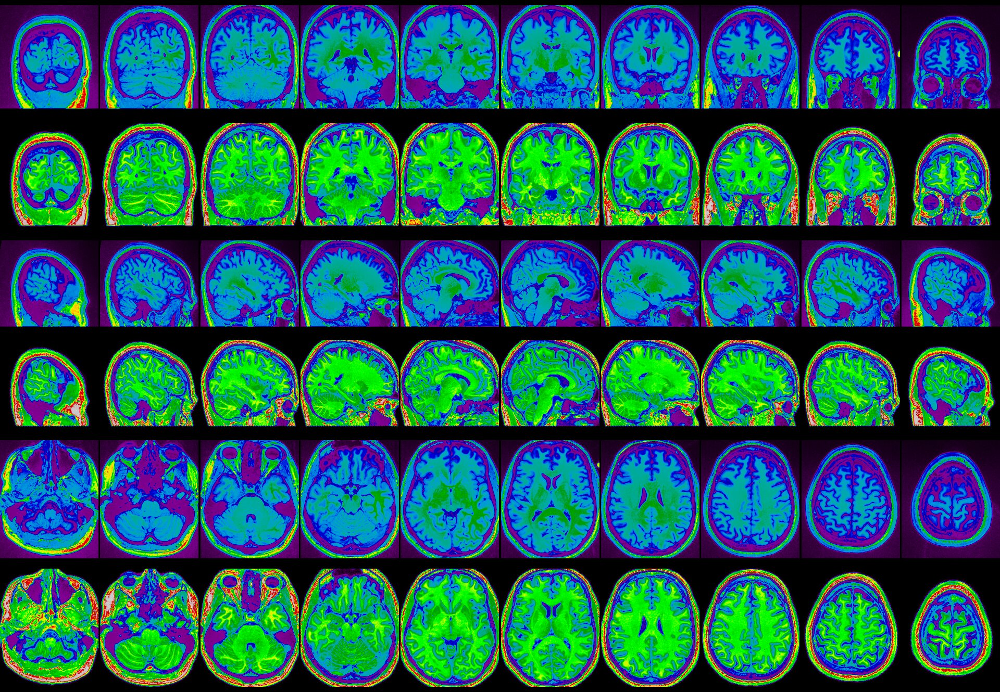
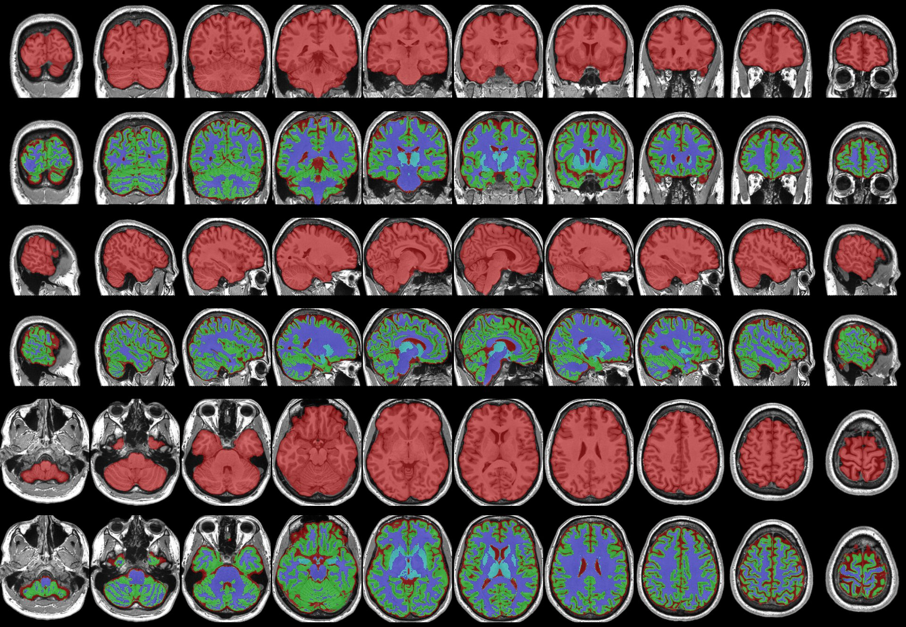
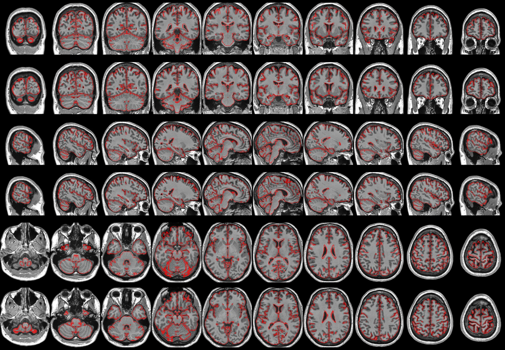

# iterativeN3 - a multi-stage MRI preprocessing pipeline

iterativeN3 is an MRI preprocessing pipeline, which at its core is intended
to correct inhomogeneites (aka bias fields) present in T1-weighted images.

There are two key implementation details which the core design is focused on

1. Implementing a `nu_correct` (aka N3) multi-scale variant similar to `N4BiasFieldCorrection` (aka ITKN4)
2. Iteratively refining the correction to the bias field by classifying the brain
tissue and focusing on the spatial intensity distribution within that tissue.

In addition, the following standardization steps are performed:

- Intensity range is rescaled 0-65535
- Intensity distribution is centered at 32767
- Intensity histogram is trimmed top and bottom 0.1%
- Head field-of-view is cropped/padded to match the FOV of the MNI ICBM model
- Image intensity outside the head is set to 0

As a side effect of the internal processes it uses to perform correction,
this pipeline also produces a number of secondary outputs suitable for use in
neuroimaging research:

- Registration (affine and non-linear transforms) to a model space (typically MNI ICBM 09c)
- Brain mask
- Brain tissue classification (GM/WM/CSF or GM/DEEPGM/WM/CSF)
- Brain tissue posterior probabilities from classification
- An intracranial volume (ICV) estimate
- A denoised (via adaptive non-local means) version of the image
- Quality control images

## Dependencies

- minc-toolkit-v2 https://bic-mni.github.io/
- BeAST library properly configured https://bic-mni.github.io/#data-files-and-models
- ANTs with MINC support enabled https://github.com/ANTsX/ANTs
- Priors (see below)
- imagemagick for a static QC image
- The webp package from google to get animated QC images: https://developers.google.com/speed/webp/download


## Usage

```bash
iterativeN3 inhomogeneity correction
Usage: ./iterativeN3.sh [-h|--help] [--(no-)standalone] [--distance <arg>] [--levels <arg>] [--cycles <arg>] [--iters <arg>] [--lambda <arg>] [--fwhm <arg>] [--stop <arg>] [--isostep <arg>] [--(no-)vessels] [--lsq6-resample-type <arg>] [--prior-config <arg>] [--(no-)fast-nlin] [--(no-)save-nlin] [-c|--(no-)clobber] [-v|--(no-)verbose] [-d|--(no-)debug] <input> <output>
        <input>: Input MINC file
        <output>: Output MINC File
        -h, --help: Prints help
        --standalone, --no-standalone: Save secondary outputs during processing (on by default)
        --distance: Initial distance for correction (default: '400')
        --levels: Levels of correction with distance halving (default: '4')
        --cycles: Cycles of correction at each level (default: '3')
        --iters: Iterations of correction for each cycle (default: '25')
        --lambda: Spline regularization value (default: '2e-6')
        --fwhm: Intensity histogram smoothing fwhm (default: '0.1')
        --stop: Stopping criterion for N3 (default: '1e-5')
        --isostep: Isotropic resampling resolution in mm for N3 (default: '4')
        --vessels, --no-vessels: Attempt to detect and exclude blood vessels (off by default)
        --lsq6-resample-type: (Standalone) Type of resampling lsq6(rigid) output files undergo, can be "coordinates", "none", or a floating point value for the isotropic resolution in mni_icbm152_t1_tal_nlin_sym_09c space (default: 'none')
        --prior-config: Config file to use for models and priors (default: 'mni_icbm152_nlin_sym_09c.cfg')
        --fast-nlin, --no-fast-nlin: Perform fast non-linear registration using Mattes similarity (off by default)
        --save-nlin, --no-save-nlin: Save the non-linear transformation to the model, implies --no-fast-nlin (off by default)
        -c, --clobber, --no-clobber: Overwrite files that already exist (off by default)
        -v, --verbose, --no-verbose: Run commands verbosely (on by default)
        -d, --debug, --no-debug: Show all internal commands and logic for debug (off by default)
```

## Getting Priors

This pipeline uses the priors available from the MNI at http://nist.mni.mcgill.ca/?page_id=714. The "ANTs" style priors
are modified versions of https://figshare.com/articles/ANTs_ANTsR_Brain_Templates/915436 to work with this pipeline
and available upon request.

## Adding your own priors

If you want to provide your own priors, the following files are required:
- `REGISTRATIONMODEL` - the t1-weighted image
- `REGISTRATIONBRAINMASK` - the brain mask
- `WMPRIOR` - a probability map of white matter
- `GMPRIOR` - a probability map of gray matter
- `CSFPRIOR` - a probability map of CSF
- (if your template is not in MNI space) `MNI_XFM`, an affine transform from your template to MNI ICBM NLIN SYM 09c space

Generate a config file defining these variables and provide it to the ``--prior-config`` option.

## Quality Control Outputs

`iterativeN3.sh` provides 3 quality control images, which provide feedback on the success of the following stages
- `<basename>.qc.bias.jpg`, alternating rows of the original image and the bias-corrected image
- `<basename>.qc.mask.classified.jpg`, alternating rows of the brain mask image and the classified image
- `<basename>.qc.bias.jpg`, alternating rows of the affine MNI outline image and the nlin MNI outline image

Additionally, `<basename>.qc.webp` an animated image which combined the static images together.

### Bias Field QC Example



### Brain Mask and Classification QC Example



### Registration QC Example

